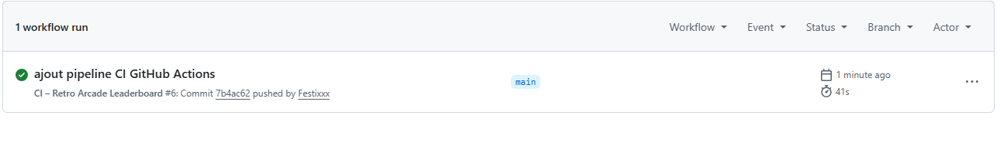
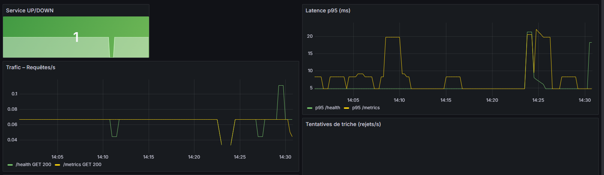
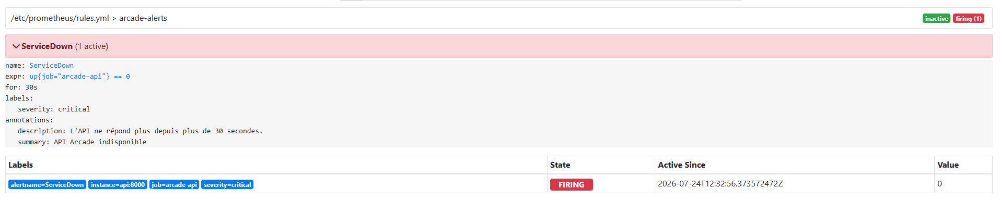

Projet DevOps – évaluation Cyber 2026.

L'API (Python/FastAPI) était fournie. On a mis en place tout ce qui l'entoure : CI, Docker, monitoring, alertes et test de charge.

---

## Lancer le projet

### Prérequis
- Docker Desktop installé et démarré

### Mode développement (hot-reload)
```bash
docker compose up --build
```

### Mode production (sans hot-reload)
```bash
docker compose -f docker-compose.yml up -d --build
```

| Service    | URL                          |
|------------|------------------------------|
| API        | http://localhost:8000        |
| Swagger    | http://localhost:8000/docs   |
| Prometheus | http://localhost:9090        |
| Grafana    | http://localhost:3000        |

Login Grafana : `admin` / `admin`

---

## CI – GitHub Actions

Pipeline qui tourne à chaque push :

1. Installation des dépendances
2. Lint avec `ruff`
3. Tests avec `pytest` (19 tests)
4. SAST avec Bandit
5. Audit des dépendances avec pip-audit
6. Build Docker + scan Trivy



---

## Docker – Dev vs Prod

| | Dev | Prod |
|--|-----|------|
| Hot-reload | ✅ | ❌ |
| Code monté en volume | ✅ | ❌ |
| Restart auto | ❌ | ✅ |
| Workers | 1 | 2 |

---

## Monitoring

Prometheus scrape `/metrics` toutes les 15s. Dashboard Grafana provisionné automatiquement.



---

## Alertes

| Alerte | Condition |
|--------|-----------|
| ServiceDown | API down depuis 30s |
| HighLatencyP95 | p95 > 500ms pendant 1min |
| HighErrorRate | > 5% de réponses en erreur |
| CheatAttemptSpike | > 5 rejets/s |

Pour déclencher ServiceDown : `docker compose stop api`



---

## Test de charge (k6)

```bash
k6 run k6/load-test.js
```

Monte de 0 à 100 utilisateurs virtuels sur 7 minutes.

---

## Structure du projet

```
.
├── app/                          # Code API fourni (non modifié)
├── tests/                        # Tests fournis (non modifiés)
├── Dockerfile                    # Multi-stage
├── docker-compose.yml            # Prod
├── docker-compose.override.yml   # Dev (hot-reload)
├── requirements.txt
├── requirements-dev.txt
├── .github/workflows/ci.yml      # Pipeline CI
├── monitoring/
│   ├── prometheus.yml
│   ├── rules.yml                 # 4 alertes
│   ├── alertmanager.yml
│   └── grafana/                  # Dashboard auto-provisionné
├── k6/load-test.js               # Test de charge
└── docs/                         # Captures d'écran
```
